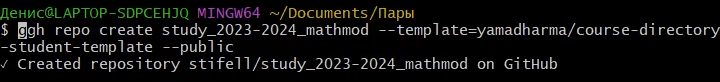
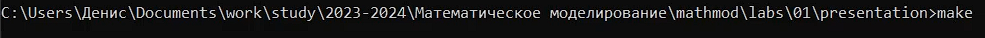

---
## Front matter
lang: ru-RU
title: Математическое моделирование
subtitle: Лабораторная работа №1
author:
  - Матюшкин Д. В.
institute:
  - Российский университет дружбы народов, Москва, Россия
date: 10 февраля 2024

## i18n babel
babel-lang: russian
babel-otherlangs: english

## Formatting pdf
toc: false
toc-title: Содержание
slide_level: 2
aspectratio: 169
section-titles: true
theme: metropolis
header-includes:
 - \metroset{progressbar=frametitle,sectionpage=progressbar,numbering=fraction}
 - '\makeatletter'
 - '\beamer@ignorenonframefalse'
 - '\makeatother'
 ## Pandoc-crossref LaTeX customization
figureTitle: "Рис."
---

# Цель работы

- Подготовить рабочее пространство для дальнейших лабораторных работ.

# Ход работы

## 1. Работа с git
- Установить Git.
- Выполнить локальные настройки для Git.
- Создать резпозиторий на Github для рабочего пространства (рис. [-@fig:001]).

{#fig:001 width=70%}

- Клонирование репозитория (рис. [-@fig:002]).

{#fig:002 width=50%}

## 2. Работа с Makefile
- Установить pandoc и Miktex (рекомендуется Texlive, но если Miktex, придется устанавливать шрифты вручную). Также установить pandoc-crossref.
- В папке для доклада и презентации прописать команду *make* для запуска Makefile (рис. [-@fig:003] и [-@fig:004]).

{#fig:003 width=70%}

{#fig:004 width=70%}

# Заключение

В ходе этой лабораторной работы мы подготовили рабочее пространство для дальнейших лабораторных работ.

## {.standout}

Спасибо за внимание!