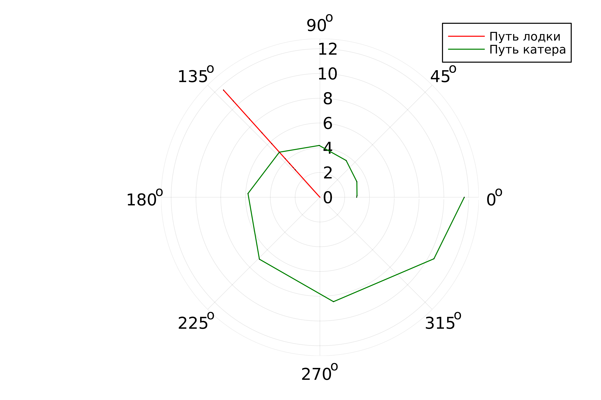
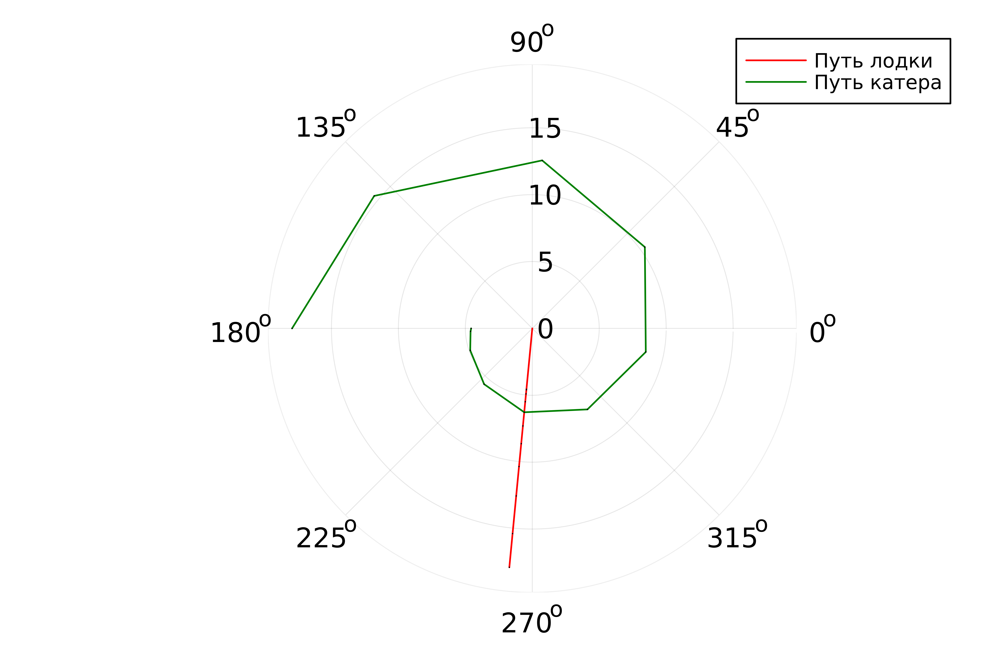

---
## Front matter
title: "Математическое моделирование"
subtitle: "Лабораторная работа №2"
author: "Матюшкин Денис Владимирович (НПИбд-02-21)"

## Generic otions
lang: ru-RU
toc-title: "Содержание"

## Bibliography
bibliography: bib/cite.bib
csl: pandoc/csl/gost-r-7-0-5-2008-numeric.csl

## Pdf output format
toc: true # Table of contents
toc-depth: 2
lof: true # List of figures
lot: true # List of tables
fontsize: 12pt
linestretch: 1.5
papersize: a4
documentclass: scrreprt
## I18n polyglossia
polyglossia-lang:
  name: russian
  options:
	- spelling=modern
	- babelshorthands=true
polyglossia-otherlangs:
  name: english
## I18n babel
babel-lang: russian
babel-otherlangs: english
## Fonts
mainfont: PT Serif
romanfont: PT Serif
sansfont: PT Sans
monofont: PT Mono
mainfontoptions: Ligatures=TeX
romanfontoptions: Ligatures=TeX
sansfontoptions: Ligatures=TeX,Scale=MatchLowercase
monofontoptions: Scale=MatchLowercase,Scale=0.9
## Biblatex
biblatex: true
biblio-style: "gost-numeric"
biblatexoptions:
  - parentracker=true
  - backend=biber
  - hyperref=auto
  - language=auto
  - autolang=other*
  - citestyle=gost-numeric
## Pandoc-crossref LaTeX customization
figureTitle: "Рис."
tableTitle: "Таблица"
listingTitle: "Листинг"
lofTitle: "Список иллюстраций"
lotTitle: "Список таблиц"
lolTitle: "Листинги"
## Misc options
indent: true
header-includes:
  - \usepackage{indentfirst}
  - \usepackage{float} # keep figures where there are in the text
  - \floatplacement{figure}{H} # keep figures where there are in the text
---

# Цель работы

Построение математической модели для выбора правильной стратегии при решении задач поиска.

# Задание
**Вариант 50**

На море в тумане катер береговой охраны преследует лодку браконьеров. Через определенный промежуток времени туман рассеивается, и лодка обнаруживаетсяна расстоянии 16,9 км от катера. Затем лодка снова скрывается в тумане и уходит прямолинейно в неизвестном направлении. Известно, что скорость катера в 4,7 раза больше скорости браконьерской лодки.

1. Запишите уравнение, описывающее движение катера, с начальными
условиями для двух случаев (в зависимости от расположения катера
относительно лодки в начальный момент времени).
2. Постройте траекторию движения катера и лодки для двух случаев.
3. Найдите точку пересечения траектории катера и лодки.

# Теоретическое введение
Julia - это высокопроизводительный язык программирования, который сочетает в себе скорость компилируемых языков с удобством использования скриптовых языков. Он предназначен для научных вычислений, анализа данных и создания высокопроизводительных приложений. Julia поддерживает многопоточность, имеет обширную экосистему библиотек и является проектом с открытым исходным кодом [@julia-doc:documentation].

OpenModelica - это свободная и открытая среда для моделирования и анализа динамических систем. Она предоставляет инструменты для создания и симуляции моделей в различных областях, таких как инженерия, наука, экономика [@openmodelica-doc:documentation].

Дифференциальные уравнения (ДУ) - это уравнения, которые содержат производные неизвестной функции. Они используются для описания изменения величин в зависимости от времени или других независимых переменных [@egorov:differential].

# Выполнение лабораторной работы
### 1. Математическая модель
1. Принимает за $t_0 = 0$, $x_л = 0$ место нахождения лодки браконьеров в
момент обнаружения, $x_к = 16,9$ - место нахождения катера береговой охраны относительно лодки браконьеров в момент обнаружения лодки.
2. Введем полярные координаты. Считаем, что полюс - это точка обнаружения
лодки браконьеров $x_л = \theta = 0$, а полярная ось $r$ проходит через точку нахождения катера береговой охраны.
3. Траектория катера должна быть такой, чтобы и катер, и лодка все время были на одном расстоянии от полюса $\theta$, только в этом случае траектория катера пересечется с траекторией лодки. 
Поэтому для начала катер береговой охраны должен двигаться некоторое время прямолинейно, пока не окажется на том же расстоянии от полюса, что и лодка браконьеров. После этого катер береговой охраны должен двигаться вокруг полюса удаляясь от него с той же скоростью, что и лодка браконьеров.
4. Чтобы найти расстояние $x$ (расстояние после которого катер начнет двигаться вокруг полюса), необходимо составить простое уравнение. Пусть через время $t$ катер и лодка окажутся на одном расстоянии $x$ от полюса. За это время лодка пройдет $x$ , а катер $16,9 - x$ (или $16,9 + x$, в зависимости от начального положения катера относительно полюса). Время, за которое они пройдут это расстояние, вычисляется как $\frac{x}{v}$ или $\frac{16,9 - x}{4,7v}$ (во втором случае $\frac{16,9 + x}{4,7v}$ ). Так как время одно и то же, то эти величины одинаковы. Тогда неизвестное расстояние $x$ можно найти из следующего уравнения:

- в пером случае
$$\frac{x_1}{v} = \frac{16,9 - x_1}{4,7v}$$ 
- во втором случае 
$$\frac{x_2}{v} = \frac{16,9 + x_2}{4,7v}$$

Отсюда мы найдем два значения $x_1 = \frac{169}{57}$ и $x_2 = \frac{169}{37}$.

5. После того, как катер береговой охраны окажется на одном расстоянии от полюса, что и лодка, он должен сменить прямолинейную траекторию и начать двигаться вокруг полюса удаляясь от него со скоростью лодки $v$.
Для этого скорость катера раскладываем на две составляющие: $v_r$ - радиальная скорость и $v_\tau$ - тангенциальная скорость (рис. 2). Радиальная скорость - это скорость, с которой катер удаляется от полюса, $v_r = \frac{dr}{dt}$. Нам нужно, чтобы эта скорость была равна скорости лодки, поэтому полагаем $\frac{dr}{dt} = v$.
Тангенциальная скорость – это линейная скорость вращения катера относительно полюса. Она равна произведению угловой скорости $\frac{d\theta}{dt}$ на радиус $r$, $v_\tau = \frac{rd\theta}{dt}$.

- $v_\tau = \sqrt{22,09v^2 - v^2}$ (учитывая, что радиальная
скорость равна $v$). Тогда получаем $\frac{rd\theta}{dt} = \sqrt{21,09}v$.

6. Решение исходной задачи сводится к решению системы из двух дифференциальных уравнений:

$\begin{cases} \frac{dr}{dt} = v \\ \frac{rd\theta}{dt} = \sqrt{21,09}v \end{cases}$
с начальными условиями $\begin{cases} \theta = 0 \\ r = x_1 \end{cases}$ или $\begin{cases} \theta = -\pi \\ r = x_2 \end{cases}$

Исключая из полученной системы производную по t, можно перейти к следующему уравнению:

$$\frac{dt}{d\theta} = \frac{r}{\sqrt{21,09}}$$

### 2. Использование языков
Используем язык Julia для решения этой задачи.

- Код программы для первого случая:

```
using DifferentialEquations
using Plots

const n = 16.9
const v = 4.7
const r = n / (v + 1)
const t1 = (0, 2pi)

function F(u, p, t)
    return u / sqrt(v*v - 1)
end

setup = ODEProblem(F, r, t1)
result = solve(setup, abstol=1e-8, reltol=1e-8)
index = rand(1:size(result.t)[1])
rAngles = [result.t[index] for i in 1:size(result.t)[1]]
plt = plot(proj=:polar, aspect_ratio=:equal, dpi = 1000, legend=true, bg=:white)
plot!(plt, [rAngles[1], rAngles[2]], [0.0, result.u[size(result.u)[1]]], label="Путь лодки", color=:red, lw=1)
scatter!(plt, rAngles, result.u, label="", mc=:red, ms=0.0005)
plot!(plt, result.t, result.u, xlabel="theta", ylabel="r(t)", label="Путь катера", color=:green, lw=1)
scatter!(plt, result.t, result.u, label="", mc=:green, ms=0.0005)
savefig(plt, "case1.png")
```

- Код программы для второго  случая:

```
using DifferentialEquations
using Plots

const n = 16.9
const v = 4.7
const r = n / (v - 1)
const t1 = (-pi, pi)

function F(u, p, t)
    return u / sqrt(v*v - 1)
end

setup = ODEProblem(F, r, t1)
result = solve(setup, abstol=1e-8, reltol=1e-8)
index = rand(1:size(result.t)[1])
rAngles = [result.t[index] for i in 1:size(result.t)[1]]
plt = plot(proj=:polar, aspect_ratio=:equal, dpi = 1000, legend=true, bg=:white)
plot!(plt, [rAngles[1], rAngles[2]], [0.0, result.u[size(result.u)[1]]], label="Путь лодки", color=:red, lw=1)
scatter!(plt, rAngles, result.u, label="", mc=:red, ms=0.0005)
plot!(plt, result.t, result.u, xlabel="theta", ylabel="r(t)", label="Путь катера", color=:green, lw=1)
scatter!(plt, result.t, result.u, label="", mc=:green, ms=0.0005)
savefig(plt, "case2.png")
```

Результаты сохраняются в виде картинки с расширешнием png (рис. @fig:001 и @fig:002).

{#fig:001 width=100%}

{#fig:002 width=100%}

В картинке видна точка пересечения лодки и катера.

# Выводы

В ходе этой лабораторной работы ознакомились c языками программирования Julia и OpenModelica. Построили математическую модель для выбора правильной стратегии при решении задач поиска.

# Список литературы{.unnumbered}

::: {#refs}
:::
