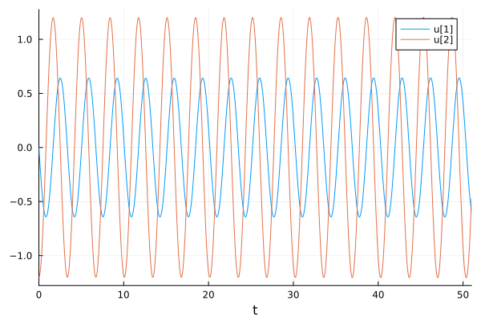
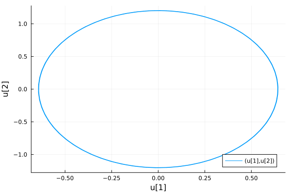
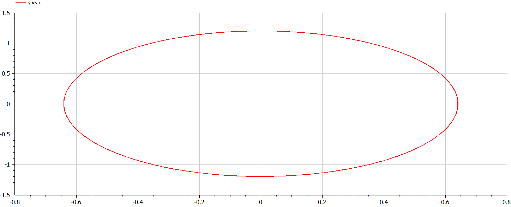
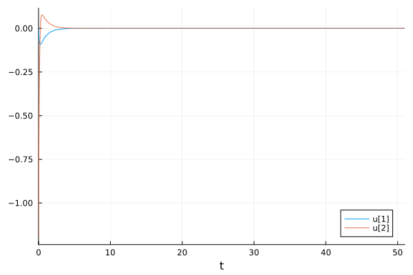
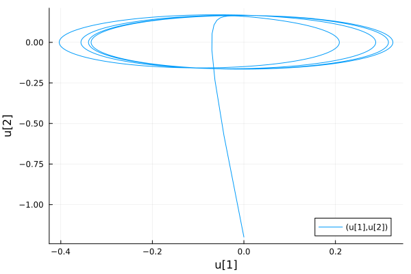
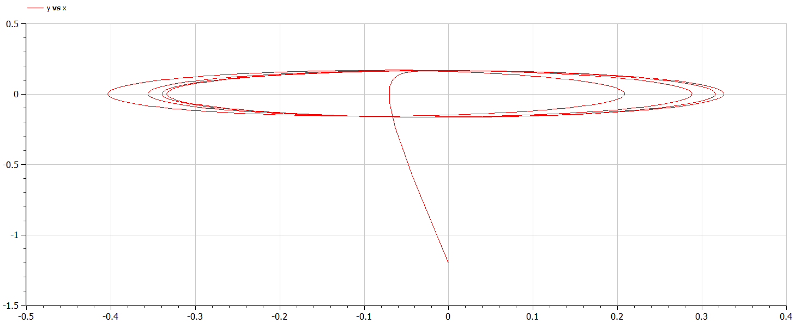

---
## Front matter
lang: ru-RU
title: Математическое моделирование
subtitle: Лабораторная работа №4
author:
  - Матюшкин Д. В.
institute:
  - Российский университет дружбы народов, Москва, Россия
date: 1 марта 2024

## i18n babel
babel-lang: russian
babel-otherlangs: english

## Formatting pdf
toc: false
toc-title: Содержание
slide_level: 2
aspectratio: 169
section-titles: true
theme: metropolis
header-includes:
 - \metroset{progressbar=frametitle,sectionpage=progressbar,numbering=fraction}
 - '\makeatletter'
 - '\beamer@ignorenonframefalse'
 - '\makeatother'

## Pandoc-crossref LaTeX customization
figureTitle: "Рис."
---

# Информация

## Докладчик

:::::::::::::: {.columns align=center}
::: {.column width="70%"}

  * Матюшкин Денис Владимирович
  * студент 3-го курса
  * группа НПИбд-02-21
  * Российский университет дружбы народов
  * [1032212279@pfur.ru](mailto:1032212279@pfur.ru)
  * <https://stifell.github.io/ru/>

:::
::: {.column width="30%"}


:::
::::::::::::::

# Цель работы

- Построение математической модели гармонических колебаний.

# Задание

## Вариант 50

Постройте фазовый портрет гармонического осциллятора и решение уравнения гармонического осциллятора для следующих случаев

1. Колебания гармонического осциллятора без затуханий и без действий внешней
силы $\ddot{x}+3.5x=0$
2. Колебания гармонического осциллятора c затуханием и без действий внешней
силы $\ddot{x}+11\dot{x}+11x=0$
3. Колебания гармонического осциллятора c затуханием и под действием внешней
силы $\ddot{x}+12\dot{x}+x=2\cos{0.5t}$

На итнтервале $t \in [ 0;51 ]$ (шаг 0.05) c начальными условиями $x_0=0, y_0=-1.2$

# Выполнение лабораторной работы

## 1. Первый случай

В системе отсутствуют потери энергии (колебания без затухания).

Получаем уравнение:
$$\ddot{x}+\omega_0^2x=0$$

Переходим к двум дифференциальным уравнениям первого порядка:
$$
 \begin{cases}
	\dot{x}=y
	\\   
	\dot{y}=-\omega_0^2x
 \end{cases}
$$

## Решение на Julia

```
using Plots
using DifferentialEquations

x0 = 0
y0 = -1.2
u0 = [x0, y0]
t0 = 0
tmax = 51
t = collect(LinRange(t0, tmax, 1000))
tspan = (t0, tmax)

w = 3.5
```

## Продолжение 

```
function lorenz(dy, y, p, t)
    dy[1] = y[2]
    dy[2] = -w*y[1]
end

prob = ODEProblem(lorenz, u0, tspan)
sol = solve(prob, saveat=t)
plot(sol)
savefig("../report/image/case1j.png")

plot(sol, idxs=(1,2))
savefig("../report/image/case1_fasj.png")
```

## Решение на OpenModelica

```
model case1

Real x(start=0);
Real y(start=-1.2);

parameter Real w = 3.5;

equation
  der(x) = y;
  der(y) = -w*x;

end case1;
```

## Результаты работы

Решение первого случая на Julia (рис. [-@fig:001] и [-@fig:002]).

{#fig:001 width=50%}

## Результаты работы

{#fig:002 width=70%}

## Результаты работы

Решение первого случая на OpenModelica (рис. [-@fig:003] и [-@fig:004]).

{#fig:003 width=70%}

## Результаты работы

{#fig:004 width=70%}

## Второй случай
В системе присутствуют потери энергии (колебания с затуханием).

Получаем уравнение:
$$\ddot{x}+2\gamma\dot{x}+\omega_0^2x=0$$

Переходим к двум дифференциальным уравнениям первого порядка:
$$
 \begin{cases}
	\dot{x}=y
	\\   
	\dot{y}=-2\gamma y-\omega_0^2x
 \end{cases}
$$

## Решение на Julia

```
using Plots
using DifferentialEquations

x0 = 0
y0 = -1.2
u0 = [x0, y0]
t0 = 0
tmax = 51
t = collect(LinRange(t0, tmax, 1000))
tspan = (t0, tmax)

w = 11
g = 11
```

## Продолжение 

```
function lorenz(dy, y, p, t)
    dy[1] = y[2]
    dy[2] = -g*y[2] - w*y[1]
end

prob = ODEProblem(lorenz, u0, tspan)
sol = solve(prob, saveat=t)
plot(sol)
savefig("../report/image/case2j.png")

plot(sol, idxs=(1,2))
savefig("../report/image/case2_fasj.png")
```

## Решение на OpenModelica

```
model case2

Real x(start=0);
Real y(start=-1.2);

parameter Real w = 11;
parameter Real g = 11;

equation
  der(x) = y;
  der(y) = -g*y-w*x;

end case2;
```

## Результаты работы

Решение второго случая на Julia (рис. [-@fig:005] и [-@fig:006]).

{#fig:005 width=50%}

## Результаты работы

{#fig:006 width=70%}

## Результаты работы

Решение второго случая на OpenModelica (рис. [-@fig:007] и [-@fig:008]).

{#fig:007 width=70%}

## Результаты работы

{#fig:008 width=70%}

## Третий случай

На систему действует внешняя сила.

Получаем уравнение:
$$\ddot{x}+2\gamma\dot{x}+\omega_0^2x=F(t)$$

Переходим к двум дифференциальным уравнениям первого порядка:
$$
 \begin{cases}
	\dot{x}=y
	\\   
	\dot{y}=F(t)-2\gamma y-\omega_0^2x
 \end{cases}
$$

## Решение на Julia

```
using Plots
using DifferentialEquations

x0 = 0
y0 = -1.2
u0 = [x0, y0]
t0 = 0
tmax = 51
t = collect(LinRange(t0, tmax, 1000))
tspan = (t0, tmax)

w = 1
g = 12
```

## Продолжение 

```
function F(t)
    return 2*cos(0.5*t)
end

function lorenz(dy, y, p, t)
    dy[1] = y[2]
    dy[2] = -g*y[2] - w*y[1] + F(t)
end

prob = ODEProblem(lorenz, u0, tspan)
sol = solve(prob, saveat=t)
plot(sol)
savefig("../report/image/case3j.png")

plot(sol, idxs=(1,2))
savefig("../report/image/case3_fasj.png")
```

## Решение на OpenModelica

```
model case3

Real x(start=0);
Real y(start=-1.2);

parameter Real w = 1;
parameter Real g = 12;

equation
  der(x) = y;
  der(y) = -g*y-w*x + 2*cos(0.5*time);

end case3;
```

## Результаты работы

Решение третьего случая на Julia (рис. [-@fig:009] и [-@fig:010]).

{#fig:009 width=50%}

## Результаты работы

{#fig:010 width=70%}

## Результаты работы

Решение третьего случая на OpenModelica (рис. [-@fig:011] и [-@fig:012]).

{#fig:011 width=70%}

## Результаты работы

{#fig:012 width=70%}

## Выводы

В ходе выполнения лабораторной работы мы построили математической модели гармонических колебаний.