---
## Front matter
title: "Математическое моделирование"
subtitle: "Лабораторная работа №4"
author: "Матюшкин Денис Владимирович (НПИбд-02-21)"

## Generic otions
lang: ru-RU
toc-title: "Содержание"

## Bibliography
bibliography: bib/cite.bib
csl: pandoc/csl/gost-r-7-0-5-2008-numeric.csl

## Pdf output format
toc: true # Table of contents
toc-depth: 2
lof: true # List of figures
lot: false # List of tables
fontsize: 12pt
linestretch: 1.5
papersize: a4
documentclass: scrreprt
## I18n polyglossia
polyglossia-lang:
  name: russian
  options:
	- spelling=modern
	- babelshorthands=true
polyglossia-otherlangs:
  name: english
## I18n babel
babel-lang: russian
babel-otherlangs: english
## Fonts
mainfont: PT Serif
romanfont: PT Serif
sansfont: PT Sans
monofont: PT Mono
mainfontoptions: Ligatures=TeX
romanfontoptions: Ligatures=TeX
sansfontoptions: Ligatures=TeX,Scale=MatchLowercase
monofontoptions: Scale=MatchLowercase,Scale=0.9
## Biblatex
biblatex: true
biblio-style: "gost-numeric"
biblatexoptions:
  - parentracker=true
  - backend=biber
  - hyperref=auto
  - language=auto
  - autolang=other*
  - citestyle=gost-numeric
## Pandoc-crossref LaTeX customization
figureTitle: "Рис."
tableTitle: "Таблица"
listingTitle: "Листинг"
lofTitle: "Список иллюстраций"
lotTitle: "Список таблиц"
lolTitle: "Листинги"
## Misc options
indent: true
header-includes:
  - \usepackage{indentfirst}
  - \usepackage{float} # keep figures where there are in the text
  - \floatplacement{figure}{H} # keep figures where there are in the text
---

# Цель работы

Построение математической модели гармонических колебаний.

# Задание
**Вариант 50**

Постройте фазовый портрет гармонического осциллятора и решение уравнения гармонического осциллятора для следующих случаев

1. Колебания гармонического осциллятора без затуханий и без действий внешней
силы $\ddot{x}+3.5x=0$
2. Колебания гармонического осциллятора c затуханием и без действий внешней
силы $\ddot{x}+11\dot{x}+11x=0$
3. Колебания гармонического осциллятора c затуханием и под действием внешней
силы $\ddot{x}+12\dot{x}+x=2\cos{0.5t}$

На итнтервале $t \in [ 0;51 ]$ (шаг 0.05) c начальными условиями $x_0=0, y_0=-1.2$


# Теоретическое введение
Julia - это высокопроизводительный язык программирования, который сочетает в себе скорость компилируемых языков с удобством использования скриптовых языков. Он предназначен для научных вычислений, анализа данных и создания высокопроизводительных приложений. Julia поддерживает многопоточность, имеет обширную экосистему библиотек и является проектом с открытым исходным кодом [@julia-doc:documentation].

OpenModelica - это свободная и открытая среда для моделирования и анализа динамических систем. Она предоставляет инструменты для создания и симуляции моделей в различных областях, таких как инженерия, наука, экономика [@openmodelica-doc:documentation].

Движение грузика на пружинке, маятника, заряда в электрическом контуре, а также эволюция во времени многих систем в физике, химии, биологии и других науках при определенных предположениях можно описать одним и тем же дифференциальным уравнением, которое в теории колебаний выступает в качестве основной модели. Эта модель называется линейным гармоническим осциллятором [@trubetskoy:fluctuations].
Уравнение свободных колебаний гармонического осциллятора имеет следующий вид:
$$\ddot{x}+2\gamma\dot{x}+\omega_0^2=0$$

где $x$ - переменная, описывающая состояние системы (смещение грузика, заряд конденсатора и т.д.), $\gamma$ - параметр, характеризующий потери энергии (трение в механической системе, сопротивление в контуре), $\omega_0$ - собственная частота колебаний.
Это уравнение есть линейное однородное дифференциальное  уравнение второго порядка и оно является примером линейной динамической системы.

При отсутствии потерь в системе ( $\gamma=0$ ) получаем уравнение консервативного осциллятора энергия колебания которого сохраняется во времени.
$$\ddot{x}+\omega_0^2x=0$$

Для однозначной разрешимости уравнения второго порядка необходимо задать два начальных условия вида
 
$$
 \begin{cases}
	x(t_0)=x_0
	\\   
	\dot{x(t_0)}=y_0
 \end{cases}
$$

Уравнение второго порядка можно представить в виде системы двух уравнений первого порядка:
$$
 \begin{cases}
	\dot{x}=y
	\\   
	\dot{y}=-\omega_0^2x
 \end{cases}
$$

Начальные условия для системы примут вид:
$$
 \begin{cases}
	x(t_0)=x_0
	\\   
	y(t_0)=y_0
 \end{cases}
$$

# Выполнение лабораторной работы
## Первый случай
В системе отсутствуют потери энергии (колебания без затухания).

Получаем уравнение:
$$\ddot{x}+\omega_0^2x=0$$

Переходим к двум дифференциальным уравнениям первого порядка:
$$
 \begin{cases}
	\dot{x}=y
	\\   
	\dot{y}=-\omega_0^2x
 \end{cases}
$$

### Решение на Julia

```
using Plots
using DifferentialEquations

x0 = 0
y0 = -1.2
u0 = [x0, y0]
t0 = 0
tmax = 51
t = collect(LinRange(t0, tmax, 1000))
tspan = (t0, tmax)

w = 3.5

function lorenz(dy, y, p, t)
    dy[1] = y[2]
    dy[2] = -w*y[1]
end

prob = ODEProblem(lorenz, u0, tspan)
sol = solve(prob, saveat=t)
plot(sol)
savefig("../report/image/case1j.png")

plot(sol, idxs=(1,2))
savefig("../report/image/case1_fasj.png")
```

### Решение на OpenModelica

```
model case1

Real x(start=0);
Real y(start=-1.2);

parameter Real w = 3.5;

equation
  der(x) = y;
  der(y) = -w*x;

end case1;
```

### Результаты работы

Решение первого случая на Julia (рис. @fig:001 и @fig:002).

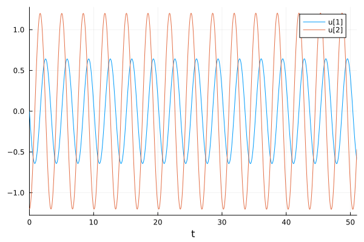{#fig:001 width=100%}

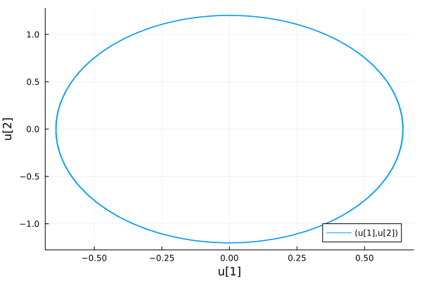{#fig:002 width=100%}

Решение первого случая на OpenModelica (рис. @fig:003 и @fig:004).

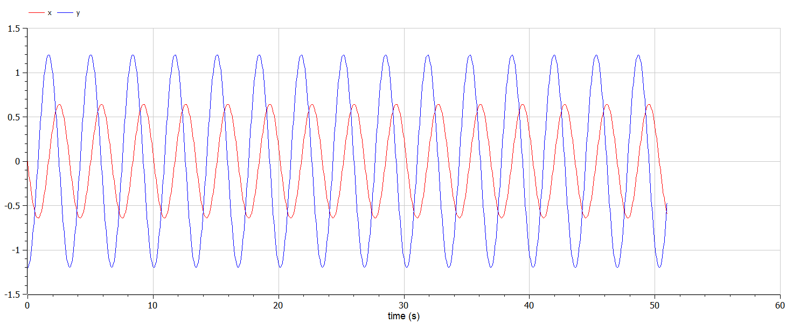{#fig:003 width=100%}

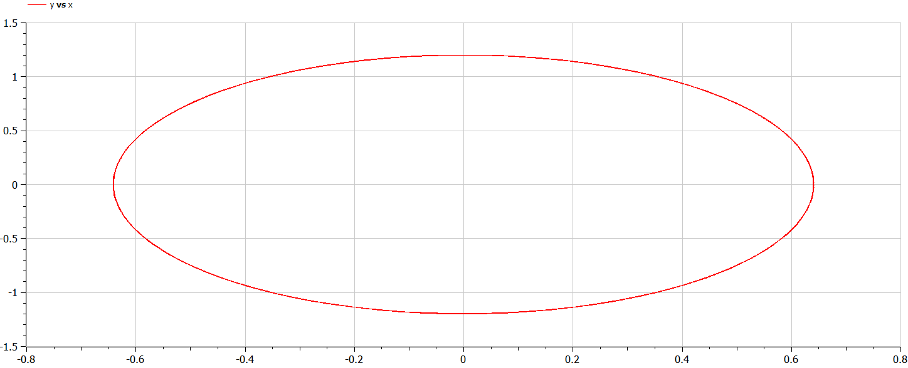{#fig:004 width=100%}

## Второй случай
В системе присутствуют потери энергии (колебания с затуханием).

Получаем уравнение:
$$\ddot{x}+2\gamma\dot{x}+\omega_0^2x=0$$

Переходим к двум дифференциальным уравнениям первого порядка:
$$
 \begin{cases}
	\dot{x}=y
	\\   
	\dot{y}=-2\gamma y-\omega_0^2x
 \end{cases}
$$


### Решение на Julia

```
using Plots
using DifferentialEquations

x0 = 0
y0 = -1.2
u0 = [x0, y0]
t0 = 0
tmax = 51
t = collect(LinRange(t0, tmax, 1000))
tspan = (t0, tmax)

w = 11
g = 11

function lorenz(dy, y, p, t)
    dy[1] = y[2]
    dy[2] = -g*y[2] - w*y[1]
end

prob = ODEProblem(lorenz, u0, tspan)
sol = solve(prob, saveat=t)
plot(sol)
savefig("../report/image/case2j.png")

plot(sol, idxs=(1,2))
savefig("../report/image/case2_fasj.png")
```

### Решение на OpenModelica

```
model case2

Real x(start=0);
Real y(start=-1.2);

parameter Real w = 11;
parameter Real g = 11;

equation
  der(x) = y;
  der(y) = -g*y-w*x;

end case2;
```

### Результаты работы

Решение второго случая на Julia (рис. @fig:005 и @fig:006).

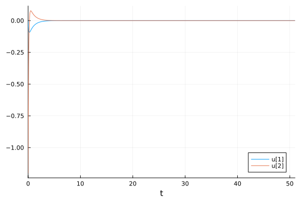{#fig:005 width=100%}

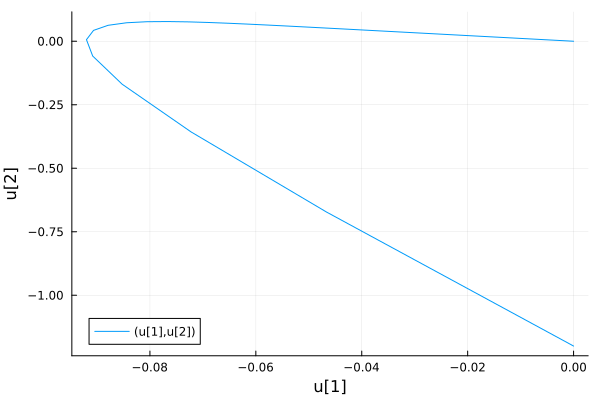{#fig:006 width=100%}

Решение второго случая на OpenModelica (рис. @fig:007 и @fig:008).

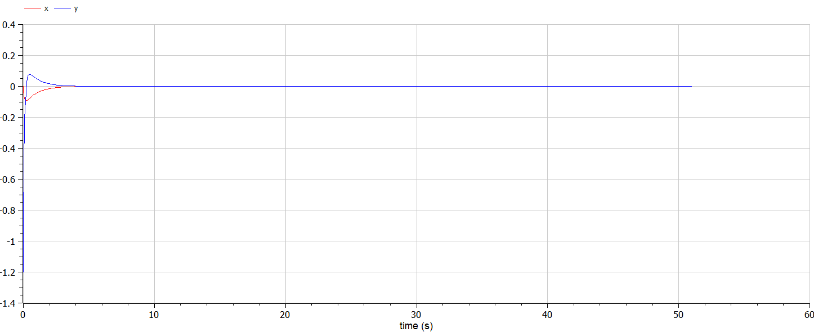{#fig:007 width=100%}

{#fig:008 width=100%}

## Третий случай

На систему действует внешняя сила.

Получаем уравнение:
$$\ddot{x}+2\gamma\dot{x}+\omega_0^2x=F(t)$$

Переходим к двум дифференциальным уравнениям первого порядка:
$$
 \begin{cases}
	\dot{x}=y
	\\   
	\dot{y}=F(t)-2\gamma y-\omega_0^2x
 \end{cases}
$$

### Решение на Julia

```
using Plots
using DifferentialEquations

x0 = 0
y0 = -1.2
u0 = [x0, y0]
t0 = 0
tmax = 51
t = collect(LinRange(t0, tmax, 1000))
tspan = (t0, tmax)

w = 1
g = 12

function F(t)
    return 2*cos(0.5*t)
end

function lorenz(dy, y, p, t)
    dy[1] = y[2]
    dy[2] = -g*y[2] - w*y[1] + F(t)
end

prob = ODEProblem(lorenz, u0, tspan)
sol = solve(prob, saveat=t)
plot(sol)
savefig("../report/image/case3j.png")

plot(sol, idxs=(1,2))
savefig("../report/image/case3_fasj.png")
```

### Решение на OpenModelica

```
model case3

Real x(start=0);
Real y(start=-1.2);

parameter Real w = 1;
parameter Real g = 12;

equation
  der(x) = y;
  der(y) = -g*y-w*x + 2*cos(0.5*time);

end case3;
```

### Результаты работы

Решение третьего случая на Julia (рис. @fig:009 и @fig:010).

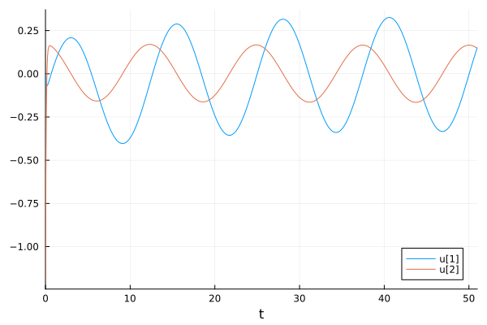{#fig:009 width=100%}

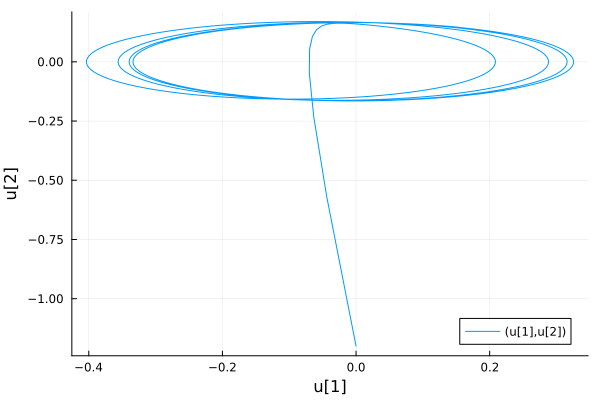{#fig:010 width=100%}

Решение третьего случая на OpenModelica (рис. @fig:011 и @fig:012).

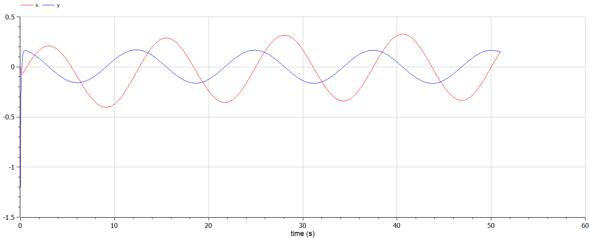{#fig:011 width=100%}

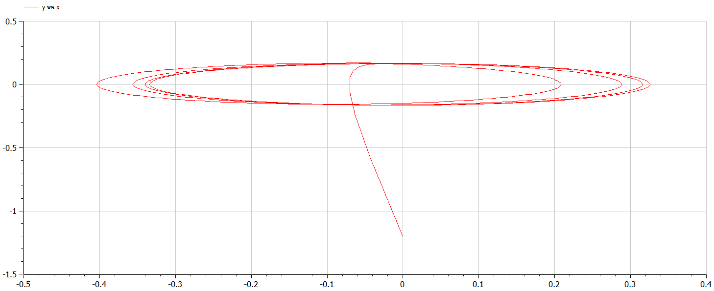{#fig:012 width=100%}

# Выводы

В ходе выполнения лабораторной работы мы построили математической модели гармонических колебаний.

# Список литературы{.unnumbered}

::: {#refs}
:::
