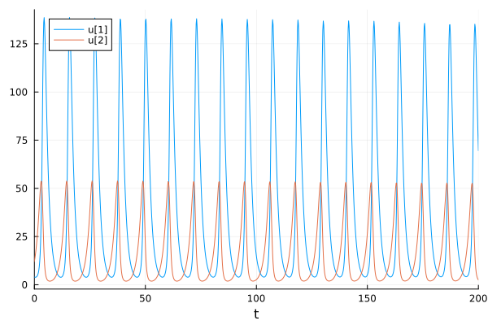
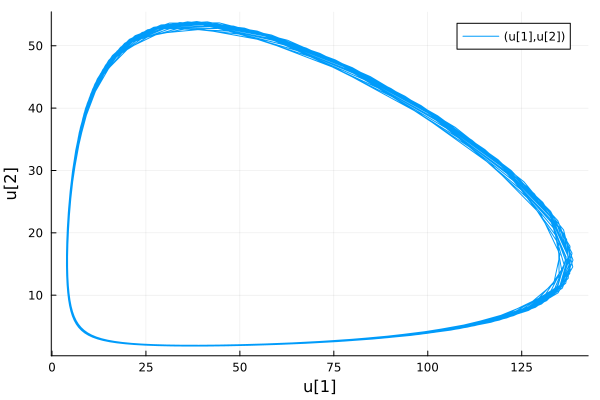
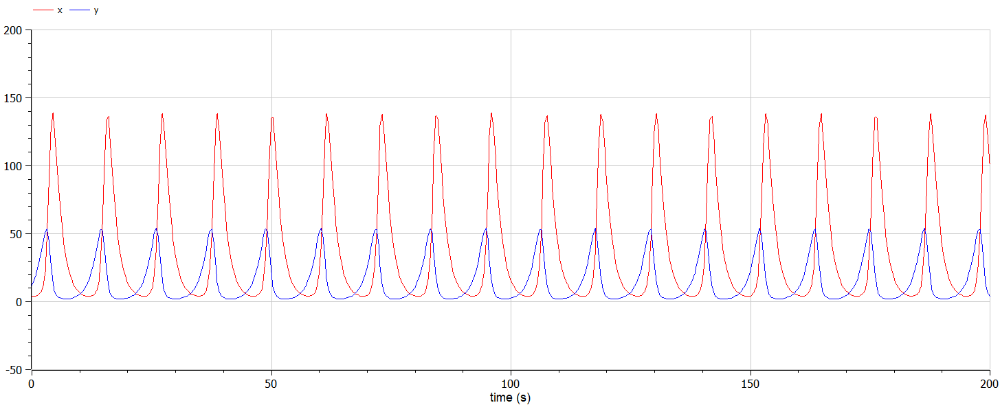
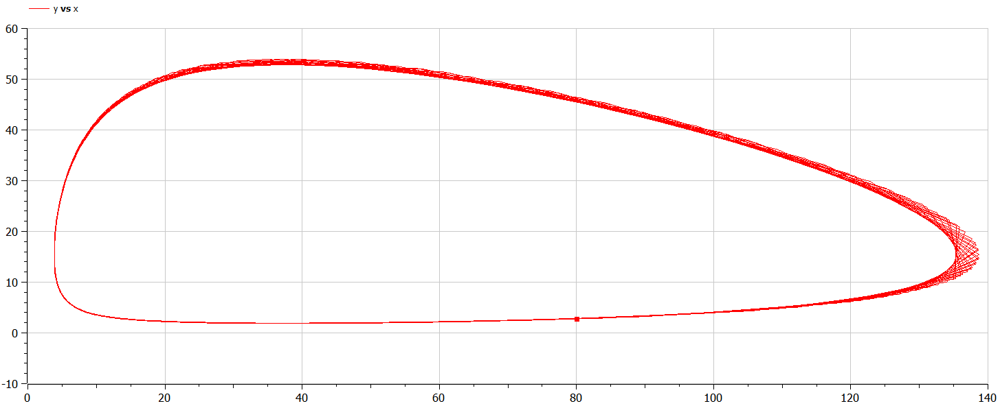

---
## Front matter
lang: ru-RU
title: Математическое моделирование
subtitle: Лабораторная работа №5
author:
  - Матюшкин Д. В.
institute:
  - Российский университет дружбы народов, Москва, Россия
date: 8 марта 2024

## i18n babel
babel-lang: russian
babel-otherlangs: english

## Formatting pdf
toc: false
toc-title: Содержание
slide_level: 2
aspectratio: 169
section-titles: true
theme: metropolis
header-includes:
 - \metroset{progressbar=frametitle,sectionpage=progressbar,numbering=fraction}
 - '\makeatletter'
 - '\beamer@ignorenonframefalse'
 - '\makeatother'

## Pandoc-crossref LaTeX customization
figureTitle: "Рис."
---

# Информация

## Докладчик

:::::::::::::: {.columns align=center}
::: {.column width="70%"}

  * Матюшкин Денис Владимирович
  * студент 3-го курса
  * группа НПИбд-02-21
  * Российский университет дружбы народов
  * [1032212279@pfur.ru](mailto:1032212279@pfur.ru)
  * <https://stifell.github.io/ru/>

:::
::: {.column width="30%"}


:::
::::::::::::::

# Цель работы

- Построение простейшей модели взаимодействия двух видов типа «хищник — жертва» - модель Лотки-Вольтерры.

# Задание

## Вариант 50

Для модели «хищник-жертва»:

$$
 \begin{cases}
	\frac{dx}{dt} = -0.71x(t) + 0.046x(t)y(t)
	\\   
	\frac{dy}{dt} = 0.64y(t) - 0.017x(t)y(t)
 \end{cases}
$$

Постройте график зависимости численности хищников от численности жертв, а также графики изменения численности хищников и численности жертв при следующих начальных условиях: $x_0=4, y_0=12$. Найдите стационарное состояние системы.

# Выполнение лабораторной работы

## Решение на Julia

```
using Plots
using DifferentialEquations

x0 = 4
y0 = 12
u0 = [x0; y0]
t0 = 0
tmax = 200
tspan = (t0, tmax)
t = collect(LinRange(t0, tmax, 1000))
a = 0.71
b = 0.046
c = 0.64
d = 0.017
```

## Продолжение

```
function syst(dy, y, p, t)
    dy[1] = -a*y[1] + b*y[1]*y[2]
    dy[2] = c*y[2] - d*y[1]*y[2]
end

prob = ODEProblem(syst, u0, tspan)
sol = solve(prob, saveat = t)

plot(sol)
savefig("../report/image/01_jl.png")

plot(sol, idxs=(1, 2))
savefig("../report/image/02_jl.png")

```

## Решение на OpenModelica

```
model lab5
Real x(start=4);
Real y(start=12);

parameter Real a = 0.71;
parameter Real b = 0.046;
parameter Real c = 0.64;
parameter Real d = 0.017;

equation
  der(x) = -a*x + b*x*y;
  der(y) = c*y - d*x*y;
end lab5;
```

# Результаты работы

## Julia

Результаты на Julia (рис. [-@fig:001] и [-@fig:002]).

{#fig:001 width=50%}

##

{#fig:002 width=70%}

## OpenModelica

Результаты на OpenModelica (рис. [-@fig:003] и [-@fig:004]).

{#fig:003 width=70%}

##

{#fig:004 width=70%}

Стационарное состояние системы будет в точке: $x_0=\frac{0.64}{0.017} \approx 37.65, y_0=\frac{0.71}{0.046} \approx 15.43$

## Выводы

- В ходе выполнения лабораторной работы мы построили простейшую модель взаимодействия двух видов типа «хищник — жертва» - модель Лотки-Вольтерры.