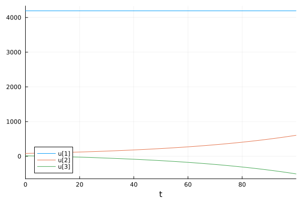
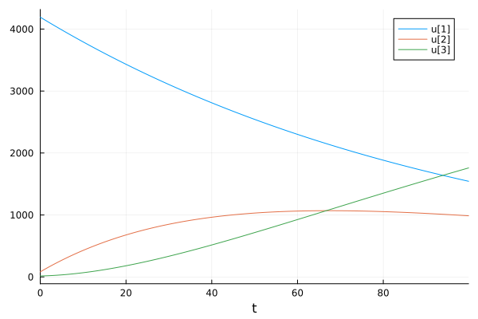
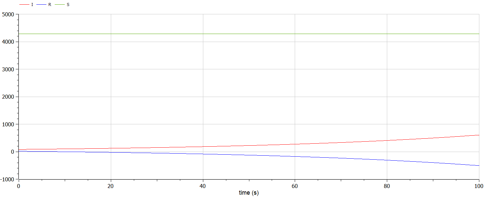
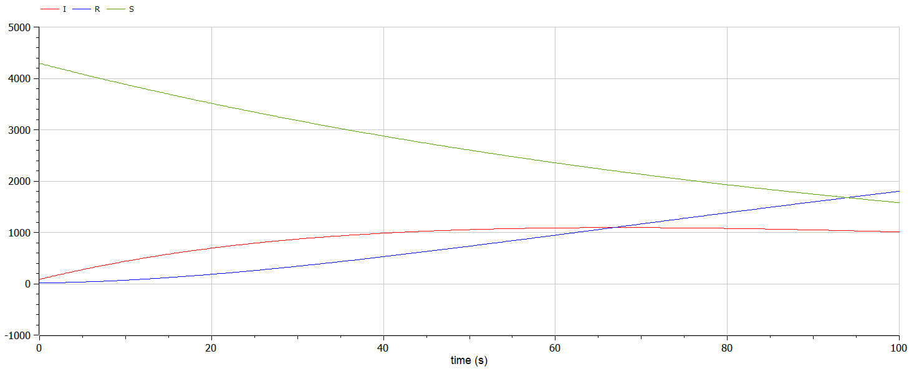

---
## Front matter
lang: ru-RU
title: Математическое моделирование
subtitle: Лабораторная работа №6
author:
  - Матюшкин Д. В.
institute:
  - Российский университет дружбы народов, Москва, Россия
date: 16 марта 2024

## i18n babel
babel-lang: russian
babel-otherlangs: english

## Formatting pdf
toc: false
toc-title: Содержание
slide_level: 2
aspectratio: 169
section-titles: true
theme: metropolis
header-includes:
 - \metroset{progressbar=frametitle,sectionpage=progressbar,numbering=fraction}
 - '\makeatletter'
 - '\beamer@ignorenonframefalse'
 - '\makeatother'

## Pandoc-crossref LaTeX customization
figureTitle: "Рис."
---

# Информация

## Докладчик

:::::::::::::: {.columns align=center}
::: {.column width="70%"}

  * Матюшкин Денис Владимирович
  * студент 3-го курса
  * группа НПИбд-02-21
  * Российский университет дружбы народов
  * [1032212279@pfur.ru](mailto:1032212279@pfur.ru)
  * <https://stifell.github.io/ru/>

:::
::: {.column width="30%"}


:::
::::::::::::::

# Цель работы

- Построение простейшей модели по здаче об эпидемии.

# Задание

## Вариант 50

На одном острове вспыхнула эпидемия. Известно, что из всех проживающих на острове $N=4289$ в момент начала эпидемии ($t=0$) число заболевших людей (являющихся распространителями инфекции) $I(0)=82$, А число здоровых людей с иммунитетом к болезни $R(0)=15$. Таким образом, число людей восприимчивых к болезни, но пока здоровых, в начальный момент времени $S(0)=N-I(0)- R(0)$.

Постройте графики изменения числа особей в каждой из трех групп. Рассмотрите, как будет протекать эпидемия в случае:

1. если $I(0) \leq I^*$
2. если $I(0) > I^*$

# Выполнение лабораторной работы

## Решение на Julia

```
using Plots
using DifferentialEquations

a = 0.01
b = 0.02

N = 4289
I = 82
R = 15
S = N-I-R

tspan = (0, 100)
t = collect(LinRange(0, 200, 1000))
u0 = [S; I; R]
```

## Продолжение

```
function syst(dy, y, p, t)
    dy[1] = 0
    dy[2] = b*y[2]
    dy[3] = -b*y[2]
end
prob = ODEProblem(syst, u0, tspan)
sol = solve(prob, saveat=t)
plot(sol)
savefig("../report/image/01.png")
function syst(dy, y, p, t)
    dy[1] = -a*y[1]
    dy[2] = a*y[1] - b*y[2]
    dy[3] = b*y[2]
end
```

## Продолжение

```
prob = ODEProblem(syst, u0, tspan)
sol = solve(prob, saveat=t)
plot(sol)
savefig("../report/image/02.png")
```

## Решение на OpenModelica №1

```
model lab6_1
parameter Real a = 0.01;
parameter Real b = 0.02;

Real S(start=4289);
Real I(start=82);
Real R(start=15);

equation
  der(S) = 0;
  der(I) = b*I;
  der(R) = -b*I;

end lab6_1;
```

## Решение на OpenModelica №2
```
model lab6_2
parameter Real a = 0.01;
parameter Real b = 0.02;

Real S(start=4289);
Real I(start=82);
Real R(start=15);

equation
  der(S) = -a*S;
  der(I) = a*S-b*I;
  der(R) = b*I;

end lab6_2;
```

# Результаты работы

## Julia

Результаты на Julia (рис. [-@fig:001] и [-@fig:002]).

{#fig:001 width=50%}

##

{#fig:002 width=70%}

## OpenModelica

Результаты на OpenModelica (рис. [-@fig:003] и [-@fig:004]).

{#fig:003 width=70%}

##

{#fig:004 width=70%}


## Выводы

- В ходе выполнения лабораторной работы мы построили простейшую модель по здаче об эпидемии.