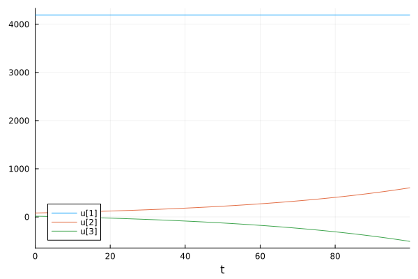
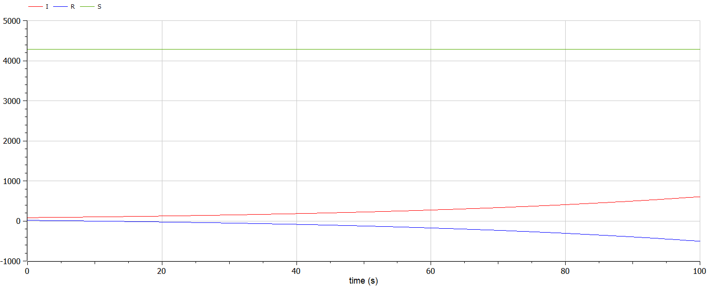
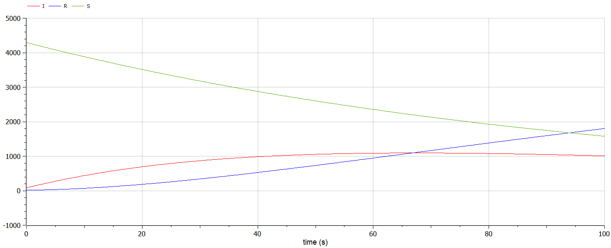

---
## Front matter
title: "Математическое моделирование"
subtitle: "Лабораторная работа №6"
author: "Матюшкин Денис Владимирович (НПИбд-02-21)"

## Generic otions
lang: ru-RU
toc-title: "Содержание"

## Bibliography
bibliography: bib/cite.bib
csl: pandoc/csl/gost-r-7-0-5-2008-numeric.csl

## Pdf output format
toc: true # Table of contents
toc-depth: 2
lof: true # List of figures
lot: false # List of tables
fontsize: 12pt
linestretch: 1.5
papersize: a4
documentclass: scrreprt
## I18n polyglossia
polyglossia-lang:
  name: russian
  options:
	- spelling=modern
	- babelshorthands=true
polyglossia-otherlangs:
  name: english
## I18n babel
babel-lang: russian
babel-otherlangs: english
## Fonts
mainfont: PT Serif
romanfont: PT Serif
sansfont: PT Sans
monofont: PT Mono
mainfontoptions: Ligatures=TeX
romanfontoptions: Ligatures=TeX
sansfontoptions: Ligatures=TeX,Scale=MatchLowercase
monofontoptions: Scale=MatchLowercase,Scale=0.9
## Biblatex
biblatex: true
biblio-style: "gost-numeric"
biblatexoptions:
  - parentracker=true
  - backend=biber
  - hyperref=auto
  - language=auto
  - autolang=other*
  - citestyle=gost-numeric
## Pandoc-crossref LaTeX customization
figureTitle: "Рис."
tableTitle: "Таблица"
listingTitle: "Листинг"
lofTitle: "Список иллюстраций"
lotTitle: "Список таблиц"
lolTitle: "Листинги"
## Misc options
indent: true
header-includes:
  - \usepackage{indentfirst}
  - \usepackage{float} # keep figures where there are in the text
  - \floatplacement{figure}{H} # keep figures where there are in the text
---

# Цель работы

Построение простейшей модели по здаче об эпидемии.

# Задание
**Вариант 50**

На одном острове вспыхнула эпидемия. Известно, что из всех проживающих на острове $N=4289$ в момент начала эпидемии ($t=0$) число заболевших людей (являющихся распространителями инфекции) $I(0)=82$, А число здоровых людей с иммунитетом к болезни $R(0)=15$. Таким образом, число людей восприимчивых к болезни, но пока здоровых, в начальный момент времени $S(0)=N-I(0)- R(0)$.

Постройте графики изменения числа особей в каждой из трех групп. Рассмотрите, как будет протекать эпидемия в случае:

1. если $I(0) \leq I^*$
2. если $I(0) > I^*$

# Теоретическое введение
Julia - это высокопроизводительный язык программирования, который сочетает в себе скорость компилируемых языков с удобством использования скриптовых языков. Он предназначен для научных вычислений, анализа данных и создания высокопроизводительных приложений. Julia поддерживает многопоточность, имеет обширную экосистему библиотек и является проектом с открытым исходным кодом [@julia-doc:documentation].

OpenModelica - это свободная и открытая среда для моделирования и анализа динамических систем. Она предоставляет инструменты для создания и симуляции моделей в различных областях, таких как инженерия, наука, экономика [@openmodelica-doc:documentation].

Рассмотрим простейшую модель эпидемии. Предположим, что некая популяция, состоящая из $N$ особей, (считаем, что популяция изолирована) подразделяется на три группы. Первая группа - это восприимчивые к болезни, но пока здоровые особи, обозначим их через $S(t)$. Вторая группа – это число инфицированных особей, которые также при этом являются распространителями инфекции, обозначим их $I(t)$. А третья группа, обозначающаяся через $R(t)$ – это здоровые особи с иммунитетом к болезни. 

До того, как число заболевших не превышает критического значения $I^*$, считаем, что все больные изолированы и не заражают здоровых. Когда $I(t)> I^*$, тогда инфицирование способны заражать восприимчивых к болезни особей. 

Таким образом, скорость изменения числа $S(t)$ меняется по следующему закону:

$$
\frac{dS}{dt}=
 \begin{cases}
	-\alpha S &\text{,если $I(t) > I^*$}
	\\   
	0 &\text{,если $I(t) \leq I^*$}
 \end{cases}
$$

Поскольку каждая восприимчивая к болезни особь, которая, в конце концов, заболевает, сама становится инфекционной, то скорость изменения числа инфекционных особей представляет разность за единицу времени между заразившимися и теми, кто уже болеет и лечится. Т.е.:

$$
\frac{dI}{dt}=
 \begin{cases}
	\alpha S -\beta I &\text{,если $I(t) > I^*$}
	\\   
	-\beta I &\text{,если $I(t) \leq I^*$}
 \end{cases}
$$

А скорость изменения выздоравливающих особей (при этом приобретающие иммунитет к болезни):

$$\frac{dR}{dt} = \beta I$$

Постоянные пропорциональности $\alpha, \beta$ - это коэффициенты заболеваемости и выздоровления соответственно. Для того, чтобы решения соответствующих уравнений определялось однозначно, необходимо задать начальные условия. Считаем, что на начало эпидемии в момент времени $t=0$ нет особей с иммунитетом к болезни $R(0)=0$, а число инфицированных и восприимчивых к болезни особей $I(0)$ и $S(0)$ соответственно. Для анализа картины протекания эпидемии необходимо рассмотреть два случая:  $I(0) \leq I^*$ и  $I(0)>I^*$


# Выполнение лабораторной работы

## Решение на Julia

```
using Plots
using DifferentialEquations

a = 0.01
b = 0.02

N = 4289
I = 82
R = 15
S = N-I-R

tspan = (0, 100)
t = collect(LinRange(0, 200, 1000))
u0 = [S; I; R]

function syst(dy, y, p, t)
    dy[1] = 0
    dy[2] = b*y[2]
    dy[3] = -b*y[2]
end

prob = ODEProblem(syst, u0, tspan)
sol = solve(prob, saveat=t)

plot(sol)

savefig("../report/image/01.png")

function syst(dy, y, p, t)
    dy[1] = -a*y[1]
    dy[2] = a*y[1] - b*y[2]
    dy[3] = b*y[2]
end

prob = ODEProblem(syst, u0, tspan)
sol = solve(prob, saveat=t)

plot(sol)

savefig("../report/image/02.png")
```

## Решение на OpenModelica

Первый случай:
```
model lab6_1
parameter Real a = 0.01;
parameter Real b = 0.02;

Real S(start=4289);
Real I(start=82);
Real R(start=15);

equation
  der(S) = 0;
  der(I) = b*I;
  der(R) = -b*I;

end lab6_1;
```

Второй случай:
```
model lab6_2
parameter Real a = 0.01;
parameter Real b = 0.02;

Real S(start=4289);
Real I(start=82);
Real R(start=15);

equation
  der(S) = -a*S;
  der(I) = a*S-b*I;
  der(R) = b*I;

end lab6_2;
```

## Результаты работы

Результаты на Julia (рис. @fig:001 и @fig:002).

{#fig:001 width=100%}

{#fig:002 width=100%}

Результаты на OpenModelica (рис. @fig:003 и @fig:004).

{#fig:003 width=100%}

{#fig:004 width=100%}

# Выводы

В ходе выполнения лабораторной работы мы построили простейшую модель по здаче об эпидемии.

# Список литературы{.unnumbered}

::: {#refs}
:::
