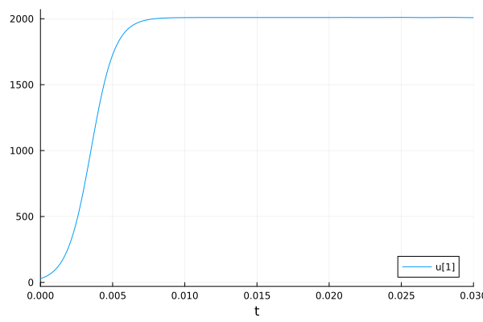
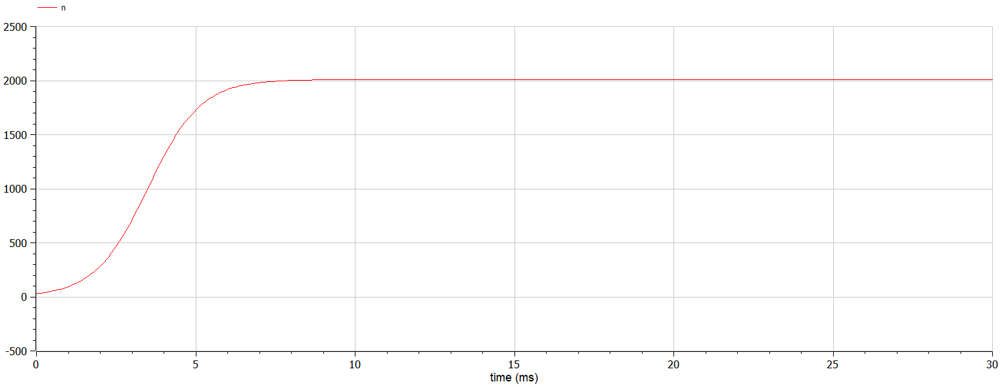

---
## Front matter
lang: ru-RU
title: Математическое моделирование
subtitle: Лабораторная работа №7
author:
  - Матюшкин Д. В.
institute:
  - Российский университет дружбы народов, Москва, Россия
date: 22 марта 2024

## i18n babel
babel-lang: russian
babel-otherlangs: english

## Formatting pdf
toc: false
toc-title: Содержание
slide_level: 2
aspectratio: 169
section-titles: true
theme: metropolis
header-includes:
 - \metroset{progressbar=frametitle,sectionpage=progressbar,numbering=fraction}
 - '\makeatletter'
 - '\beamer@ignorenonframefalse'
 - '\makeatother'

## Pandoc-crossref LaTeX customization
figureTitle: "Рис."
---

# Информация

## Докладчик

:::::::::::::: {.columns align=center}
::: {.column width="70%"}

  * Матюшкин Денис Владимирович
  * студент 3-го курса
  * группа НПИбд-02-21
  * Российский университет дружбы народов
  * [1032212279@pfur.ru](mailto:1032212279@pfur.ru)
  * <https://stifell.github.io/ru/>

:::
::: {.column width="30%"}


:::
::::::::::::::

# Цель работы

- Построение простейшей модели эффективности рекламы. 

# Задание

## Вариант 50

Постройте график распространения рекламы, математическая модель которой описывается следующим уравнением:

1. $\frac{dn}{dt} = (0.66 + 0.00006n(t))(N-n(t))$
2. $\frac{dn}{dt} = (0.000066 + 0.6n(t))(N-n(t))$
3. $\frac{dn}{dt} = (0.66t + 0.6tn(t))(N-n(t))$

При этом объем аудитории $N = 2010$, в начальный момент о товаре знает 29 человек. Для случая 2 определите в какой момент времени скорость распространения рекламы будет иметь максимальное значение.

# Выполнение лабораторной работы

## Решение на Julia

```
using Plots
using DifferentialEquations

a = 0.66
b = 0.00006
N = 2010
tmax = 5
tspan = (0, tmax)
t = collect(LinRange(0, tmax, 500))
n = 29

function syst(dy, y, p, t)
    dy[1] = (a+b*y[1])*(N-y[1])
end
```

## Продолжение

```
prob = ODEProblem(syst, [n], tspan)
sol = solve(prob, saveat=t)
plot(sol)
savefig("01.png")

a = 0.000066
b = 0.6
N = 2010
tmax= 0.03
tspan = (0, tmax)
t = collect(LinRange(0, tmax, 500))
n = 29
```

## Продолжение

```
function syst(dy, y, p, t)
    dy[1] = (a+b*y[1])*(N-y[1])
end

prob = ODEProblem(syst, [n], tspan)
sol = solve(prob, saveat=t)
plot(sol)
savefig("02.png")

a = 0.66
b = 0.6
N = 2010
```

## Продолжение

```
tmax = 0.03
tspan = (0, tmax)
t = collect(LinRange(0, tmax, 500))
n = 29

function syst(dy, y, p, t)
    dy[1] = (a*t+b*t*y[1])*(N-y[1])
end

prob = ODEProblem(syst, [n], tspan)
sol = solve(prob, saveat=t)
plot(sol)
savefig("03.png")
```

## Решение на OpenModelica №1

```
model lab7_1
parameter Real a = 0.66;
parameter Real b = 0.00006;
parameter Real N = 2010;

Real n(start=29);

equation
  der(n) = (a+b*n) * (N-n);
  
end lab7_1;
```

## Решение на OpenModelica №2

```
model lab7_2
parameter Real a = 0.000066;
parameter Real b = 0.6;
parameter Real N = 2010;

Real n(start=29);

equation
  der(n) = (a+b*n) * (N-n);
  
end lab7_2;
```

## Решение на OpenModelica №3

```
model lab7_3
parameter Real a = 0.66;
parameter Real b = 0.6;
parameter Real N = 2010;

Real n(start=29);

equation
  der(n) = (a*time+b*time*n) * (N-n);
  
end lab7_3;
```

# Результаты работы

## Julia

Результаты на Julia (рис. [-@fig:001], [-@fig:002] и [-@fig:003]).

{#fig:001 width=50%}

##

{#fig:002 width=70%}

##

{#fig:003 width=70%}

## OpenModelica

Результаты на OpenModelica (рис. [-@fig:004], [-@fig:005] и [-@fig:006]).

{#fig:004 width=70%}

##

{#fig:005 width=70%}

##

{#fig:006 width=70%}

## Выводы

- В ходе выполнения лабораторной работы мы построили простейшую моделю эффективности рекламы.