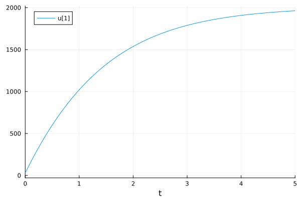
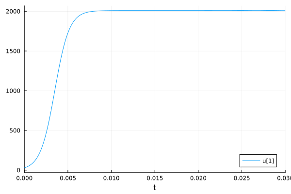
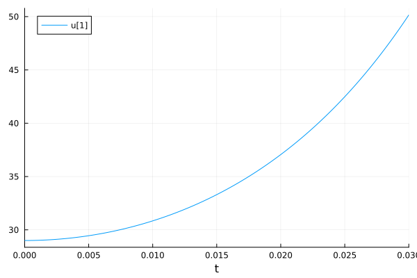
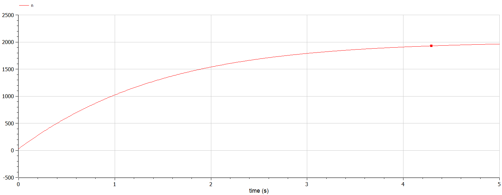
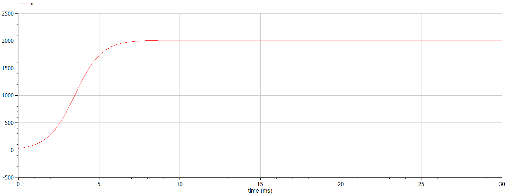
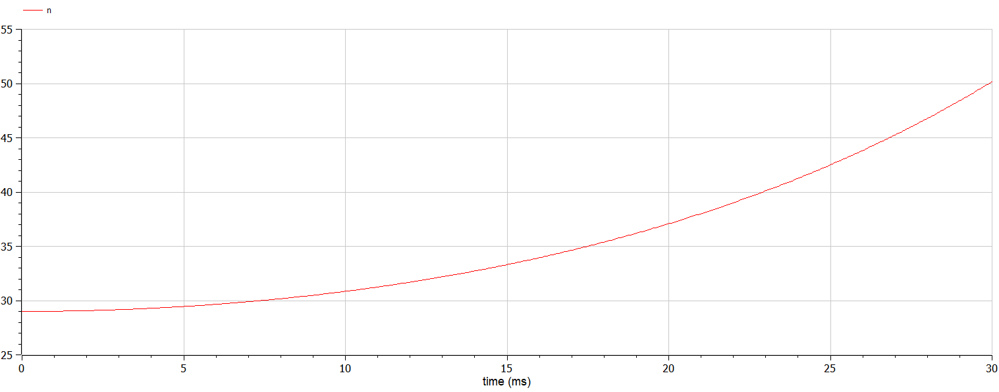

---
## Front matter
title: "Математическое моделирование"
subtitle: "Лабораторная работа №7"
author: "Матюшкин Денис Владимирович (НПИбд-02-21)"

## Generic otions
lang: ru-RU
toc-title: "Содержание"

## Bibliography
bibliography: bib/cite.bib
csl: pandoc/csl/gost-r-7-0-5-2008-numeric.csl

## Pdf output format
toc: true # Table of contents
toc-depth: 2
lof: true # List of figures
lot: false # List of tables
fontsize: 12pt
linestretch: 1.5
papersize: a4
documentclass: scrreprt
## I18n polyglossia
polyglossia-lang:
  name: russian
  options:
	- spelling=modern
	- babelshorthands=true
polyglossia-otherlangs:
  name: english
## I18n babel
babel-lang: russian
babel-otherlangs: english
## Fonts
mainfont: PT Serif
romanfont: PT Serif
sansfont: PT Sans
monofont: PT Mono
mainfontoptions: Ligatures=TeX
romanfontoptions: Ligatures=TeX
sansfontoptions: Ligatures=TeX,Scale=MatchLowercase
monofontoptions: Scale=MatchLowercase,Scale=0.9
## Biblatex
biblatex: true
biblio-style: "gost-numeric"
biblatexoptions:
  - parentracker=true
  - backend=biber
  - hyperref=auto
  - language=auto
  - autolang=other*
  - citestyle=gost-numeric
## Pandoc-crossref LaTeX customization
figureTitle: "Рис."
tableTitle: "Таблица"
listingTitle: "Листинг"
lofTitle: "Список иллюстраций"
lotTitle: "Список таблиц"
lolTitle: "Листинги"
## Misc options
indent: true
header-includes:
  - \usepackage{indentfirst}
  - \usepackage{float} # keep figures where there are in the text
  - \floatplacement{figure}{H} # keep figures where there are in the text
---

# Цель работы

Построение простейшей модели эффективности рекламы. 

# Задание
**Вариант 50**

Постройте график распространения рекламы, математическая модель которой описывается следующим уравнением:

1. $\frac{dn}{dt} = (0.66 + 0.00006n(t))(N-n(t))$
2. $\frac{dn}{dt} = (0.000066 + 0.6n(t))(N-n(t))$
3. $\frac{dn}{dt} = (0.66t + 0.6tn(t))(N-n(t))$

При этом объем аудитории $N = 2010$, в начальный момент о товаре знает 29 человек. Для случая 2 определите в какой момент времени скорость распространения рекламы будет иметь максимальное значение.


# Теоретическое введение
Julia - это высокопроизводительный язык программирования, который сочетает в себе скорость компилируемых языков с удобством использования скриптовых языков. Он предназначен для научных вычислений, анализа данных и создания высокопроизводительных приложений. Julia поддерживает многопоточность, имеет обширную экосистему библиотек и является проектом с открытым исходным кодом [@julia-doc:documentation].

OpenModelica - это свободная и открытая среда для моделирования и анализа динамических систем. Она предоставляет инструменты для создания и симуляции моделей в различных областях, таких как инженерия, наука, экономика [@openmodelica-doc:documentation].

Организуется рекламная кампания нового товара или услуги. Необходимо, чтобы прибыль будущих продаж с избытком покрывала издержки на рекламу. Вначале расходы могут превышать прибыль, поскольку лишь малая часть потенциальных покупателей будет информирована о новинке. Затем, при увеличении числа продаж, возрастает и прибыль, и, наконец, наступит момент, когда рынок насытиться, и рекламировать товар станет бесполезным.

Предположим, что торговыми учреждениями реализуется некоторая продукция, о которой в момент времени $t$ из числа потенциальных покупателей $N$ знает лишь $n$ покупателей. Для ускорения сбыта продукции запускается реклама по радио, телевидению и других средств массовой информации. После запуска рекламной кампании информация о продукции начнет распространяться среди потенциальных покупателей путем общения друг с другом. Таким образом, после запуска рекламных объявлений скорость изменения числа знающих о продукции людей пропорциональна как числу знающих о товаре покупателей, так и числу покупателей о нем не знающих

Модель рекламной кампании описывается следующими величинами.
Считаем, что $\frac{dn}{dt}$ - скорость изменения со временем числа потребителей, узнавших о товаре и готовых его купить,
$t$ - время, прошедшее с начала рекламной кампании,
$N$ - общее число потенциальных платежеспособных покупателей,
$n(t)$ - число  уже информированных клиентов.
Эта величина пропорциональна числу покупателей, еще не знающих о нем, это описывается следующим образом
$\alpha_1(t)(N-n(t))$, где $\alpha_1>0$ -  характеризует интенсивность рекламной кампании (зависит от затрат на рекламу в данный момент времени).
Помимо этого, узнавшие о товаре потребители также распространяют полученную информацию среди потенциальных покупателей, не знающих о нем (в этом случае работает т.н. сарафанное радио). Этот вклад в рекламу описывается величиной  $\alpha_2(t)n(t)(N-n(t))$. эта величина увеличивается с увеличением потребителей узнавших о товаре.

Математическая модель распространения рекламы описывается уравнением:

$$\frac{dn}{dt} = (\alpha_1(t) + \alpha_2(t)n(t))(N-n(t))$$

- При $\alpha_1(t) >> \alpha_2(t)$ получается модель типа модели Мальтуса.

- В обратном случае $\alpha_1(t) << \alpha_2(t)$ получаем уравнение логистической кривой.

# Выполнение лабораторной работы

## Решение на Julia

```
using Plots
using DifferentialEquations

a = 0.66
b = 0.00006
N = 2010

tmax = 5
tspan = (0, tmax)
t = collect(LinRange(0, tmax, 500))
n = 29

function syst(dy, y, p, t)
    dy[1] = (a+b*y[1])*(N-y[1])
end

prob = ODEProblem(syst, [n], tspan)
sol = solve(prob, saveat=t)

plot(sol)

savefig("01.png")

a = 0.000066
b = 0.6
N = 2010

tmax= 0.03
tspan = (0, tmax)
t = collect(LinRange(0, tmax, 500))
n = 29

function syst(dy, y, p, t)
    dy[1] = (a+b*y[1])*(N-y[1])
end

prob = ODEProblem(syst, [n], tspan)
sol = solve(prob, saveat=t)

plot(sol)

savefig("02.png")

a = 0.66
b = 0.6
N = 2010

tmax = 0.03
tspan = (0, tmax)
t = collect(LinRange(0, tmax, 500))
n = 29

function syst(dy, y, p, t)
    dy[1] = (a*t+b*t*y[1])*(N-y[1])
end

prob = ODEProblem(syst, [n], tspan)
sol = solve(prob, saveat=t)

plot(sol)

savefig("03.png")
```

## Решение на OpenModelica

Первый случай:
```
model lab7_1
parameter Real a = 0.66;
parameter Real b = 0.00006;
parameter Real N = 2010;

Real n(start=29);

equation
  der(n) = (a+b*n) * (N-n);
  
end lab7_1;
```

Второй случай:
```
model lab7_2
parameter Real a = 0.000066;
parameter Real b = 0.6;
parameter Real N = 2010;

Real n(start=29);

equation
  der(n) = (a+b*n) * (N-n);
  
end lab7_2;
```

Скорость распространения рекламы будет иметь максимальное значение при $t = 0$.

Третий случай:
```
model lab7_3
parameter Real a = 0.66;
parameter Real b = 0.6;
parameter Real N = 2010;

Real n(start=29);

equation
  der(n) = (a*time+b*time*n) * (N-n);
  
end lab7_3;
```

## Результаты работы

Результаты на Julia (рис. @fig:001, @fig:002 и @fig:003).

{#fig:001 width=100%}

{#fig:002 width=100%}

{#fig:003 width=100%}

Результаты на OpenModelica (рис. @fig:004, @fig:005 и @fig:006).

{#fig:004 width=100%}

{#fig:005 width=100%}

{#fig:006 width=100%}

# Выводы

В ходе выполнения лабораторной работы мы построили простейшую моделю эффективности рекламы.

# Список литературы{.unnumbered}

::: {#refs}
:::
