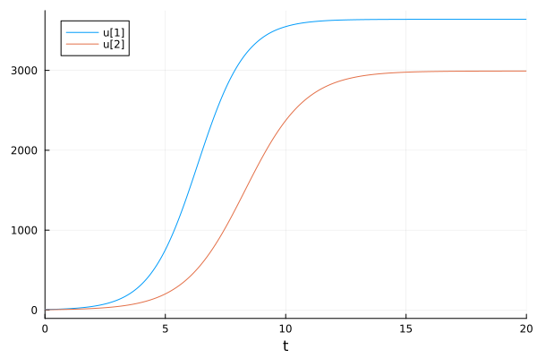
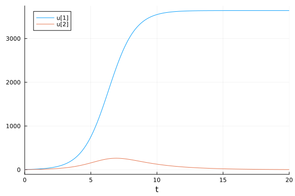
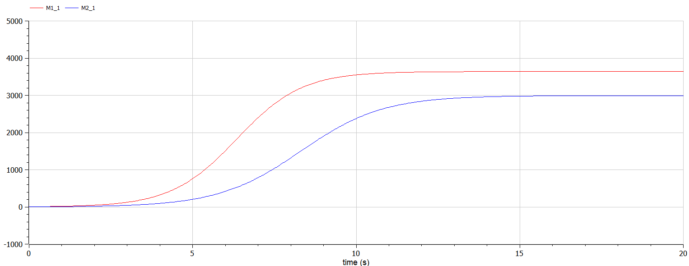
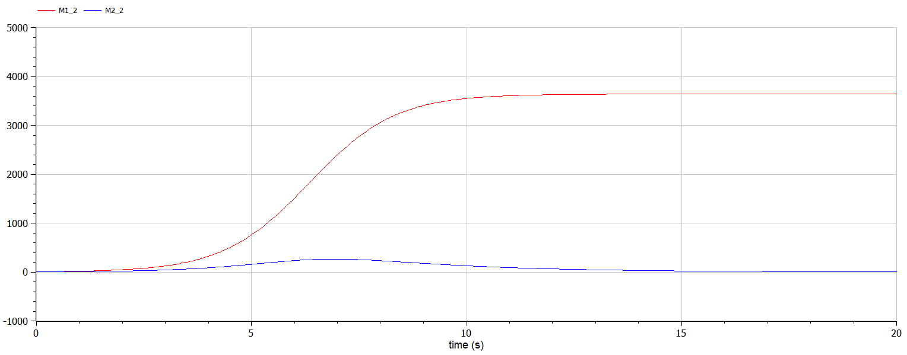

---
## Front matter
lang: ru-RU
title: Математическое моделирование
subtitle: Лабораторная работа №8
author:
  - Матюшкин Д. В.
institute:
  - Российский университет дружбы народов, Москва, Россия
date: 30 марта 2024

## i18n babel
babel-lang: russian
babel-otherlangs: english

## Formatting pdf
toc: false
toc-title: Содержание
slide_level: 2
aspectratio: 169
section-titles: true
theme: metropolis
header-includes:
 - \metroset{progressbar=frametitle,sectionpage=progressbar,numbering=fraction}
 - '\makeatletter'
 - '\beamer@ignorenonframefalse'
 - '\makeatother'

## Pandoc-crossref LaTeX customization
figureTitle: "Рис."
---

# Информация

## Докладчик

:::::::::::::: {.columns align=center}
::: {.column width="70%"}

  * Матюшкин Денис Владимирович
  * студент 3-го курса
  * группа НПИбд-02-21
  * Российский университет дружбы народов
  * [1032212279@pfur.ru](mailto:1032212279@pfur.ru)
  * <https://stifell.github.io/ru/>

:::
::: {.column width="30%"}


:::
::::::::::::::

# Цель работы

- Построение модели конкуренции двух фирм. 

# Задание

## Вариант 50

Случай 1
Рассмотрим две фирмы, производящие взаимозаменяемые товары одинакового качества и находящиеся в одной рыночной нише. Считаем, что в рамках нашей модели конкурентная борьба ведётся только рыночными методами. То есть, конкуренты могут влиять на противника путем изменения параметров своего производства: себестоимость, время цикла, но не могут прямо вмешиваться в ситуацию на рынке («назначать» цену или влиять на потребителей каким-либо иным способом):

$$\frac{dM_1}{d\Theta} = M_1 - \frac{b}{c_1}M_1 M_2 - \frac{a1}{c1} M_1^2 $$

$$ \frac{dM_2}{d\Theta} = \frac{c_2}{c_1} M_2 - \frac{b}{c_1} M_1 M_2 - \frac{a_2}{c_1} M_2^2$$

## Вариант 50

где 
$$ a_1 = \frac{p_{cr}}{\tau_1^2 \widetilde{p}_1^2 Nq } $$
$$ a_2 = \frac{p_{cr}}{\tau_2^2 \widetilde{p}_2^2 Nq } $$ 
$$ b = \frac{p_{cr}}{\tau_1^2 \widetilde{p}_1^2 \tau_2^2 \widetilde{p}_2^2 Nq} $$
$$ c_1 = \frac{p_{cr} - \widetilde{p}_1}{\tau_1 \widetilde{p}_1} $$
$$ c_2 = \frac{p_{cr} - \widetilde{p}_2}{\tau_2 \widetilde{p}_2} $$

Также введена нормировка $t = c_1 \Theta$.

## Вариант 50

Случай 2
Рассмотрим модель, когда, помимо экономического фактора влияния (изменение себестоимости, производственного цикла, использование кредита и т.п.), используются еще и социально-психологические факторы – формирование общественного предпочтения одного товара другому, не зависимо от их качества и цены. В этом случае взаимодействие двух фирм будет зависеть друг от друга, соответственно коэффициент перед $M_1 M_2$ будет отличаться. Пусть в рамках рассматриваемой модели динамика изменения объемов продаж фирмы 1 и фирмы 2 описывается следующей системой уравнений:

## Вариант 50

$$\frac{dM_1}{d\Theta} = M_1 - \frac{b}{c_1}M_1 M_2 - \frac{a1}{c1} M_1^2 $$

$$ \frac{dM_2}{d\Theta} = \frac{c_2}{c_1} M_2 - (\frac{b}{c_1} + 0.00031) M_1 M_2 - \frac{a_2}{c_1} M_2^2$$

Для обоих случаев рассмотрим задачу со следующими начальными условиями и параметрами

$$ M_0^1=6.4 \: M_0^2=4.1 $$
$$ p_{cr}=20 \: N=40 \: q=1 $$
$$ \tau_1=20 \: \tau_2=15 $$
$$ \widetilde{p}_1=7 \: \widetilde{p}_2=9.5 $$

# Выполнение лабораторной работы

## Решение на Julia

```
using Plots
using DifferentialEquations

p_cr=20
N=40
q=1
tau1=20
tau2=15
p1=7
p2=9.5
d = 0.00031
a1 = p_cr/(tau1*tau1*p1*p1*N*q)
a2 = p_cr/(tau2*tau2*p2*p2*N*q)
c1 = (p_cr-p1)/(tau1*p1)
```

## Продолжение

```
c2 = (p_cr-p2)/(tau2*p2)
b = p_cr/(tau1*tau1*p1*p1*tau2*tau2*p2*p2*N*q)
M1=6.4
M2=4.1
t = collect(LinRange(0, 20, 500))
tspan = (0, 20)

function syst(dy, y, p, t)
    dy[1] = y[1] - (b/c1)*y[1]*y[2] - (a1/c1)*y[1]*y[1]
    dy[2] = (c2/c1)*y[2] - (b/c1)*y[1]*y[2] - (a2/c1)*y[2]*y[2]
end
prob = ODEProblem(syst, [M1, M2], tspan)
sol = solve(prob, saveat=t)
```

## Продолжение

```
plot(sol)
savefig("../report/image/01.png")
function syst(dy, y, p, t)
    dy[1] = y[1] - (b/c1)*y[1]*y[2] - (a1/c1)*y[1]*y[1]
    dy[2] = (c2/c1)*y[2] - (b/c1+d)*y[1]*y[2] - (a2/c1)*y[2]*y[2]
end
prob = ODEProblem(syst, [M1, M2], tspan)
sol = solve(prob, saveat=t)
plot(sol)
savefig("../report/image/02.png")
```

## Решение на OpenModelica №1

```
model lab8
parameter Real p_cr=20;
parameter Real N=40;
parameter Real q=1;
parameter Real tau1=20;
parameter Real tau2=15;
parameter Real p1=7;
parameter Real p2=9.5;
parameter Real d=0.00031;
parameter Real a1 = p_cr/(tau1*tau1*p1*p1*N*q);
parameter Real a2 = p_cr/(tau2*tau2*p2*p2*N*q);
parameter Real b = p_cr/(tau1*tau1*p1*p1*tau2*tau2*p2*p2*N*q);
parameter Real c1 = (p_cr-p1)/(tau1*p1);
parameter Real c2 = (p_cr-p2)/(tau2*p2);
```

## Продолжение

```
Real M1_1(start=6.4);
Real M2_1(start=4.1);
Real M1_2(start=6.4);
Real M2_2(start=4.1);

equation
  der(M1_1) = M1_1 - (b/c1)*M1_1*M2_1 - (a1/c1)*M1_1*M1_1;
  der(M2_1) = (c2/c1)*M2_1 - (b/c1)*M1_1*M2_1 - (a2/c1)*M2_1*M2_1;
  
equation
  der(M1_2) = M1_2 - (b/c1)*M1_2*M2_2 - (a1/c1)*M1_2*M1_2;
  der(M2_2) = (c2/c1)*M2_2 - (b/c1+d)*M1_2*M2_2 - (a2/c1)*M2_2*M2_2;
     
end lab8;
```

# Результаты работы

## Julia

Результаты на Julia (рис. [-@fig:001] и [-@fig:002]).

{#fig:001 width=50%}

##

{#fig:002 width=70%}


## OpenModelica

Результаты на OpenModelica (рис. [-@fig:003] и [-@fig:004]).

{#fig:003 width=70%}

##

{#fig:004 width=70%}


## Выводы

- В ходе выполнения лабораторной работы мы построили модель конкуренции двух фирм.