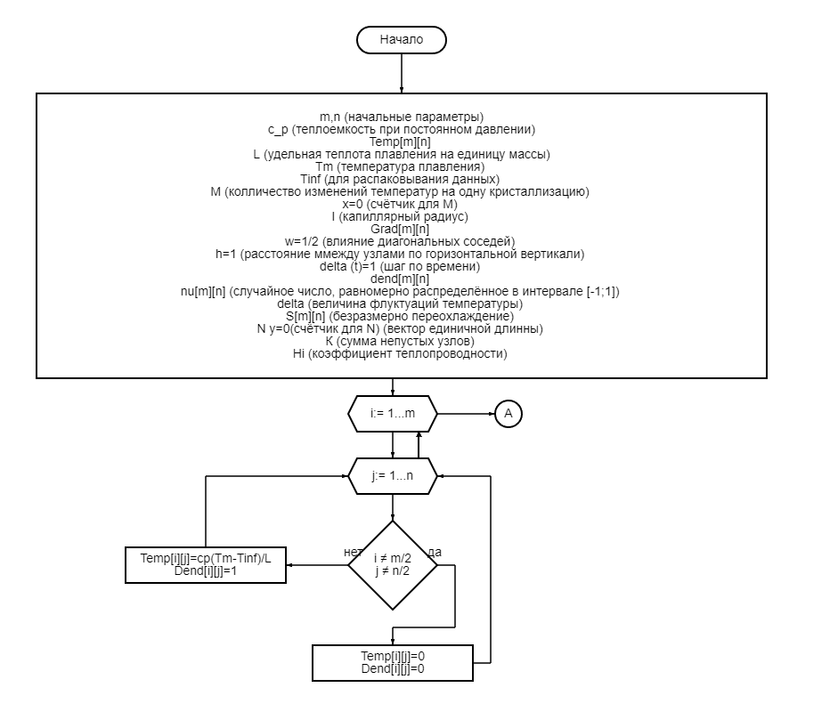
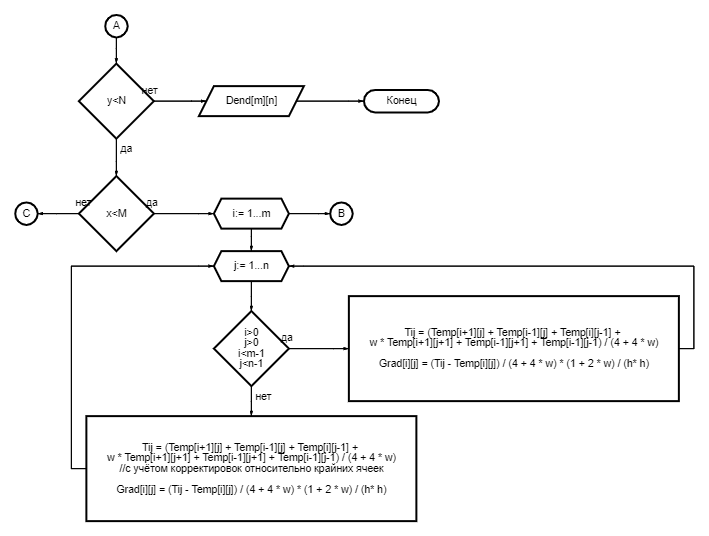
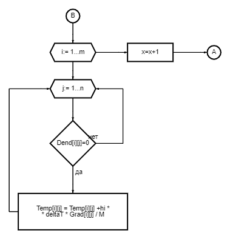
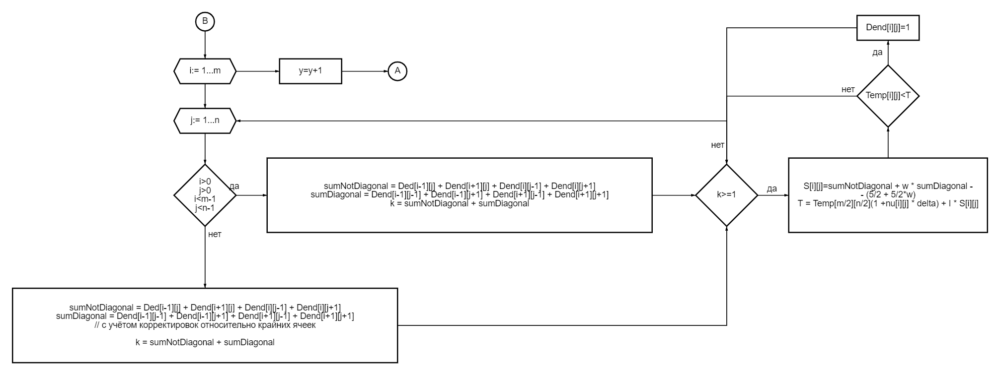

---
## Front matter
lang: ru-RU
title: Рост дендритов
subtitle: Этап №2
author:
  - Миронов Д. А.
  - Павлова П. А.
  - Матюшкин Д. В.
institute:
  - Российский университет дружбы народов, Москва, Россия
date: 02 марта 2024

## i18n babel
babel-lang: russian
babel-otherlangs: english

## Formatting pdf
toc: false
toc-title: Содержание
slide_level: 2
aspectratio: 169
section-titles: true
theme: metropolis
header-includes:
 - \metroset{progressbar=frametitle,sectionpage=progressbar,numbering=fraction}
 - '\makeatletter'
 - '\beamer@ignorenonframefalse'
 - '\makeatother'

 ## Pandoc-crossref LaTeX customization
figureTitle: "Рис."
---

## Алгоритм роста дендритов

Алгоритм, используемый в проекте для моделирования роста дендритов, включает в себя несколько шагов:

1. Инициализация: Задаются начальные условия, такие как размеры области, начальные значения температуры и состояния узлов.

2. Уравнение теплопроводности: Используется уравнение теплопроводности для моделирования распространения тепла в системе. Оно описывает, как температура изменяется со временем и пространством внутри области.

3. Вычисление среднего значения температуры в соседних узлах: Для каждого узла вычисляется среднее значение температуры с учетом температур соседних узлов и их коэффициентов.

## Алгоритм роста дендритов

4. Обновление температуры в каждом узле: Новое значение температуры вычисляется на основе предыдущего значения температуры, шага по времени и градиента температуры.

5. Моделирование роста дендритов: Учитываются состояния каждого узла, а также влияние соседей на процесс роста дендритов.

6. Учет теплового шума: К температуре каждого узла добавляется случайная добавка, моделирующая тепловой шум.

7. Изменение состояния узлов на границе: Узлы на границе могут изменять свое состояние с жидкого на твердое в зависимости от условий роста дендритов.

## Алгоритм роста дендритов

Этот алгоритм моделирования роста дендритов имеет несколько преимуществ:

1. Учет различных факторов.

2. Адаптивность.

3. Вычислительная эффективность.

## Алгоритм роста дендритов

## Алгоритм роста дендритов

## Алгоритм роста дендритов

## Алгоритм роста дендритов

## Заключение и выводы

На данном этапе мы рассмотрели алгоритм по созданию и росту дендритов. Изучили каждый из его этапов и построили схему.
