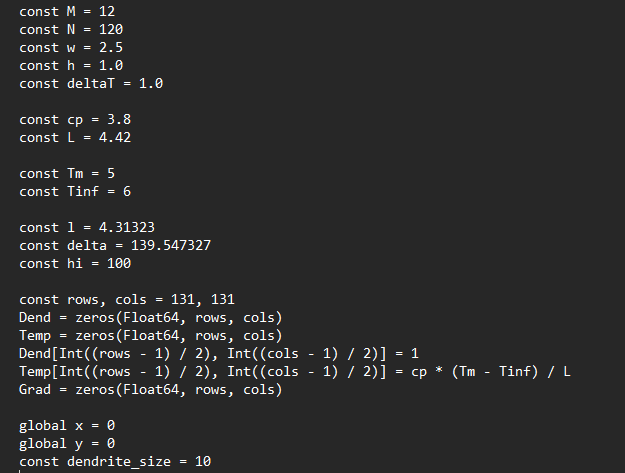
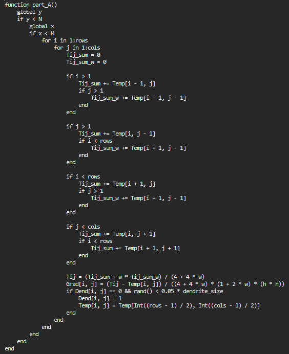
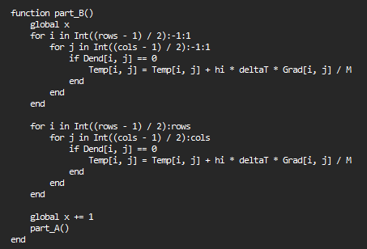
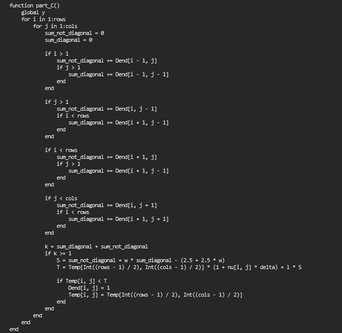
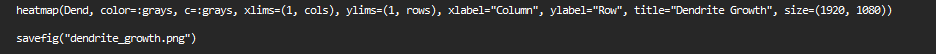

---
## Front matter
lang: ru-RU
title: Рост дендритов
subtitle: Этап №3
author:
  - Миронов Д. А.
  - Павлова П. А.
  - Матюшкин Д. В.
institute:
  - Российский университет дружбы народов, Москва, Россия
date: 09 марта 2024

## i18n babel
babel-lang: russian
babel-otherlangs: english

## Formatting pdf
toc: false
toc-title: Содержание
slide_level: 2
aspectratio: 169
section-titles: true
theme: metropolis
header-includes:
 - \metroset{progressbar=frametitle,sectionpage=progressbar,numbering=fraction}
 - '\makeatletter'
 - '\beamer@ignorenonframefalse'
 - '\makeatother'

 ## Pandoc-crossref LaTeX customization
figureTitle: "Рис."
---

## Цель работы

- Написать программу для реализации модели роста дендритов

## Основные блоки кода

1. Инициализация необходимых переменных;

2. Обработка диффузии температуры через пространство моделирования;

3. Обновление значения температуры вдоль определенного пути;

4. Определение, где происходит рост дендритов на основе определенных условий;

5. Сохранение результата в виде фотографии.

## Программная реализация
{height=90%}

## Программная реализация
{height=90%}

## Программная реализация
{height=90%}

## Программная реализация
{height=90%}

## Программная реализация
{height=90%}

## Результат

## Выводы

- На данном этапе мы рассмотрели программную реализацию по росту дендритов