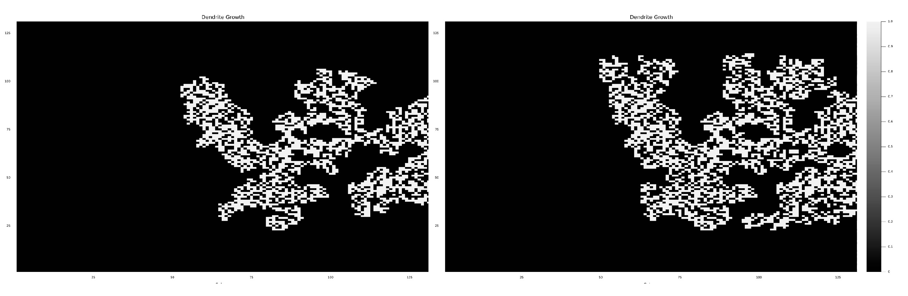

---
## Front matter
lang: ru-RU
title: Рост дендритов
subtitle: Этап №4
author:
  - Миронов Д. А.
  - Павлова П. А.
  - Матюшкин Д. В.
institute:
  - Российский университет дружбы народов, Москва, Россия
date: 20 марта 2024

## i18n babel
babel-lang: russian
babel-otherlangs: english

## Formatting pdf
toc: false
toc-title: Содержание
slide_level: 2
aspectratio: 169
section-titles: true
theme: metropolis
header-includes:
 - \metroset{progressbar=frametitle,sectionpage=progressbar,numbering=fraction}
 - '\makeatletter'
 - '\beamer@ignorenonframefalse'
 - '\makeatother'

 ## Pandoc-crossref LaTeX customization
figureTitle: "Рис."
---

## Цели и задачи

Целью проекта является математическое моделирование дендритного роста.

Задачи проекта:

1. Изучить теоретическую информацию о дендритах и о моделях их роста.
2. Разработать алгоритм, который включает в себя:
- моделирование теплопроводности;
- исследование влияние начального переохлаждения $S$ и величины капиллярного радиуса $\lambda$ на форму образующихся дендритов;
- исследование зависимость от времени числа частиц в агрегате и его среднеквадратичного радиуса в разных режимах;
- определение фрактальной размерности полученных образцов;
- исследвание влияния величины теплового шума $\delta$ на вид образующихся агрегатов;
3. Написать комплексы программ по разработанному алгоритму;

## Описание явления роста дендритов
Дендриты - это маленькие ветвистые образования, похожие на деревья или ветви, которые могут появляться в разных системах, от нервных клеток до кристаллов в металлах.

Самые распространённые структуры морозных узоров — дендриты.

## Описание модели
- Рассматривается квадратная область размера N × N узлов с затвердевшей затравкой в центре.

- Используется уравнение теплопроводности для описания изменения температуры во времени.

## Основные уравнения модели
- Уравнение теплопроводности описывает изменение температуры в узлах с учетом свойств вещества:

$$ \rho c_p \frac{\partial T}{\partial t} = \kappa \nabla^2 T \equiv \kappa (\frac{\partial^2 T}{\partial x^2} + \frac{\partial^2 T}{\partial y^2}) $$

- Для вычисления изменения температуры используется среднее значение температуры соседних узлов:

$$ \langle T_{(i,j)} \rangle = (T_{(i+1,j)} + T_{(i-1,j)} + T_{(i,j+1)} + T_{(i,j-1)} + $$

$$ + w(T_{(i+1,j+1)} + T_{(i+1,j-1)} + T_{(i-1,j+1)} + T_{(i-1,j-1)}))/(4+4w) $$

## Рост дендрита
- Состояние каждого узла может быть жидким (0) или твердым (1).

- Рост дендрита определяется путем изменения состояния узлов на границе жидкой и твердой фазы.

## Тепловой шум

- Учитывается случайная добавка к температуре в узле, чтобы моделировать тепловой шум.

- Узел на границе переходит в твердую фазу при определенных условиях температуры и капиллярного радиуса.

## Алгоритм роста дендритов

1. Инициализация

2. Уравнение теплопроводности

3. Вычисление среднего значения температуры в соседних узлах

4. Обновление температуры в каждом узле

5. Моделирование роста дендритов

6. Учет теплового шума

7. Изменение состояния узлов на границе

## Преимущества алгоритма

Этот алгоритм моделирования роста дендритов имеет несколько преимуществ:

1. Учет различных факторов.

2. Адаптивность.

3. Вычислительная эффективность.

## Программная реализация

- Код написан на языке программирования Julia, обеспечивающем эффективное выполнение алгоритма.

## Основные блоки кода

1. Инициализация необходимых переменных;

2. Обработка диффузии температуры через пространство моделирования;

3. Обновление значения температуры вдоль определенного пути;

4. Определение, где происходит рост дендритов на основе определенных условий;

5. Сохранение результата в виде фотографии.

## Результат

## Заключение

- В заключении проекта по моделированию дендритного роста мы успешно создали алгоритм, учитывающий различные факторы, такие как теплопроводность, начальное переохлаждение, капиллярный радиус и тепловой шум. Написали комплексы программ по разработанному алгоритму.